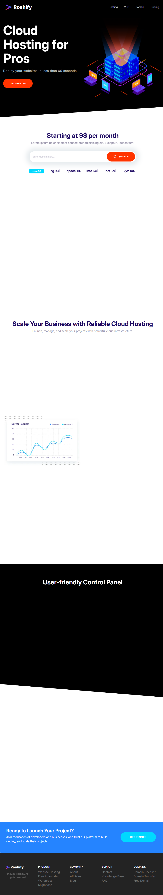

# Roshify Landing Page

A modern, responsive landing page built with HTML and CSS, focused on clean design, performance, and scalable UI components.

## 🚀 Live Demo
https://roshified.netlify.app

## 📁 Repository
https://github.com/roshavafaei/roshify-landing-page

---

## ✨ Features

- Responsive design (mobile-first approach)
- Clean and modern UI
- Reusable UI components (cards, buttons, sections)
- Optimized images (WebP + fallback)
- Pricing section with highlighted plan
- Consistent spacing and layout system
- Semantic and well-structured HTML

---

## 🛠️ Tech Stack

- HTML5
- CSS3 (BEM methodology)
- Responsive Design
- Netlify (Deployment)

---

## ⚡ Performance

- Optimized assets for faster loading
- Lightweight and efficient structure
- Improved visual performance and UX

---

## 📸 Preview

---

## 📌 Overview

This project demonstrates a front-end implementation of a cloud hosting landing page with a focus on usability, visual hierarchy, and performance.

---

## 🧑‍💻 Author

Rosha Vafaee